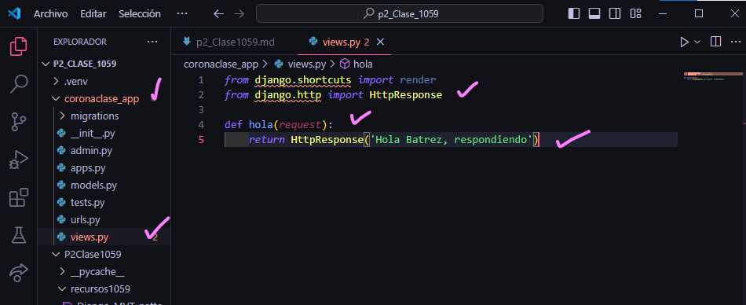

- Crear aplicacion corona_clase_app
- comando --> python manage.py startapp coronaclase_app
- Creamos el archivo urls.py en coronaclase_app

- En setting.py de p2clase1059
- 
- En urls.py de p2clase1059
- 
- en urls.py en coronaclase 

- en views.py en coronaclase_app

en urls.py en navaclase_app
